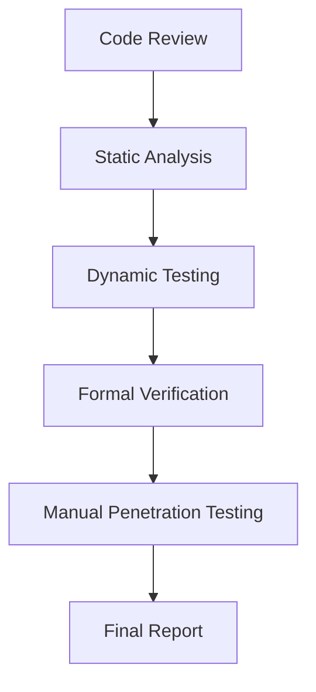

# Blockchain Security Explainer

**Author: Fidel**

## Table of Contents
1. [Introduction](#introduction)
2. [Blockchain Threat Models](#threat-models)
3. [Consensus Attack Types](#consensus-attacks)
4. [Private/Public Key Safety](#key-safety)
5. [Smart Contract Security](#smart-contract-security)
6. [Best Practices](#best-practices)
7. [References](#references)

## Introduction

Blockchain technology has revolutionized digital transactions and data integrity, but it also introduces unique security challenges. This comprehensive guide explores the critical security aspects of blockchain systems, from cryptographic foundations to implementation vulnerabilities.

## Threat Models

### 1. External Adversaries
- **Network-level attacks**: Targeting communication between nodes
- **DDoS attacks**: Overwhelming network infrastructure
- **Eclipse attacks**: Isolating nodes from the honest network

### 2. Internal Adversaries
- **Malicious miners/validators**: Compromised consensus participants
- **Selfish mining**: Strategic withholding of blocks for profit
- **Nothing-at-stake problem**: In Proof-of-Stake systems

### 3. Protocol-level Threats
- **Fork attacks**: Attempting to create competing chains
- **Time-based attacks**: Exploiting timestamp vulnerabilities
- **Cryptographic breaks**: Quantum computing threats

## Consensus Attack Types

### 51% Attacks
```
Scenario: Attacker controls >50% of network hash power
Impact: Double-spending, transaction censorship, chain reorganization
Mitigation: Distributed mining pools, checkpointing
```

### Sybil Attacks
- Creating multiple fake identities to influence network decisions
- Particularly dangerous in reputation-based systems
- **Prevention**: Proof-of-Work, Proof-of-Stake, identity verification

### Long-Range Attacks
- Rewriting blockchain history from genesis block
- Specific to Proof-of-Stake systems
- **Mitigation**: Weak subjectivity, checkpointing

### Grinding Attacks
- Manipulating randomness in consensus mechanisms
- Affects validator selection in PoS
- **Solution**: Verifiable Random Functions (VRFs)

## Private/Public Key Safety

### Key Generation Security
```bash
# Secure entropy sources
- Hardware random number generators
- Environmental noise collection
- Multiple entropy sources combination
```

### Key Storage Best Practices

#### Hot Wallets vs Cold Storage
| Aspect | Hot Wallet | Cold Storage |
|--------|------------|---------------|
| Accessibility | High | Low |
| Security | Lower | Higher |
| Use Case | Daily transactions | Long-term storage |

#### Hardware Security Modules (HSMs)
- Tamper-resistant hardware for key storage
- Secure key generation and cryptographic operations
- Enterprise-grade protection

### Common Key Management Vulnerabilities
1. **Weak random number generation**
2. **Unencrypted private key storage**
3. **Key reuse across different systems**
4. **Insufficient backup procedures**
5. **Social engineering attacks**

## Smart Contract Security

### Common Vulnerabilities

#### 1. Reentrancy Attacks
```solidity
// Vulnerable code
function withdraw(uint amount) public {
    require(balances[msg.sender] >= amount);
    msg.sender.call{value: amount}("");
    balances[msg.sender] -= amount; // This happens after external call
}

// Secure version
function withdraw(uint amount) public {
    require(balances[msg.sender] >= amount);
    balances[msg.sender] -= amount; // Update state first
    msg.sender.call{value: amount}("");
}
```

#### 2. Integer Overflow/Underflow
```solidity
// Use SafeMath library or Solidity 0.8+
using SafeMath for uint256;

uint256 result = a.add(b); // Instead of a + b
```

#### 3. Access Control Issues
- Missing or incorrect permission checks
- Default visibility leading to unintended exposure
- Centralization risks with admin functions

#### 4. Oracle Manipulation
- Price feed attacks
- Flash loan exploits
- Time-based manipulation

### Smart Contract Auditing Process



## Best Practices

### For Developers

#### Smart Contract Development
- **Use established patterns**: OpenZeppelin libraries
- **Implement checks-effects-interactions pattern**
- **Use events for transparency**
- **Implement circuit breakers/pause functionality**
- **Regular security audits**

#### Code Example: Secure Transfer
```solidity
contract SecureTransfer {
    mapping(address => uint256) public balances;
    
    modifier nonReentrant() {
        require(!locked, "ReentrancyGuard: reentrant call");
        locked = true;
        _;
        locked = false;
    }
    
    function transfer(address to, uint256 amount) 
        external 
        nonReentrant 
    {
        require(balances[msg.sender] >= amount, "Insufficient balance");
        require(to != address(0), "Invalid recipient");
        
        balances[msg.sender] -= amount;
        balances[to] += amount;
        
        emit Transfer(msg.sender, to, amount);
    }
}
```

### For Users

#### Transaction Security
- **Verify recipient addresses** before sending
- **Use recommended gas prices** to avoid stuck transactions
- **Monitor for suspicious activity**
- **Keep software updated**

#### Wallet Security
- **Use reputable wallet providers**
- **Enable multi-factor authentication**
- **Regular backup of seed phrases**
- **Verify transaction details** before signing

### For Network Operators

#### Node Security
- **Regular software updates**
- **Network segmentation**
- **Monitoring and alerting systems**
- **DDoS protection**
- **Secure key management**

#### Consensus Participation
- **Diversified validator sets**
- **Slashing conditions implementation**
- **Economic incentive alignment**
- **Transparent governance processes**

## Security Monitoring and Incident Response

### Real-time Monitoring
```yaml
metrics_to_monitor:
  - transaction_volume_anomalies
  - unusual_gas_usage_patterns
  - large_value_transactions
  - smart_contract_failures
  - network_hash_rate_changes
  - validator_performance
```

### Incident Response Plan
1. **Detection**: Automated alerts and monitoring
2. **Assessment**: Severity and impact evaluation
3. **Containment**: Immediate protective measures
4. **Investigation**: Root cause analysis
5. **Recovery**: System restoration
6. **Lessons Learned**: Process improvement

## Emerging Security Challenges

### Quantum Computing Threats
- **Timeline**: Potentially 10-15 years for cryptographically relevant quantum computers
- **Impact**: Current elliptic curve cryptography vulnerable
- **Preparation**: Quantum-resistant algorithms development

### Cross-Chain Security
- **Bridge vulnerabilities**: Multi-billion dollar attack vector
- **Atomic swap security**: Ensuring fairness
- **Interoperability protocols**: New attack surfaces

### Layer 2 Solutions
- **State channel security**: Off-chain computation risks
- **Rollup challenges**: Data availability and fraud proofs
- **Plasma security**: Mass exit scenarios

## References

### Academic Papers
- [Bitcoin: A Peer-to-Peer Electronic Cash System](https://bitcoin.org/bitcoin.pdf) - Satoshi Nakamoto
- [Ethereum Whitepaper](https://ethereum.org/en/whitepaper/) - Vitalik Buterin
- [The Bitcoin Lightning Network](https://lightning.network/lightning-network-paper.pdf)

### Security Resources
- [ConsenSys Smart Contract Best Practices](https://consensys.github.io/smart-contract-best-practices/)
- [OWASP Blockchain Security](https://owasp.org/www-project-blockchain-security/)
- [Trail of Bits Security Reviews](https://github.com/trailofbits/publications)

### Tools and Frameworks
- [MythX](https://mythx.io/) - Smart contract security analysis
- [Slither](https://github.com/crytic/slither) - Static analysis framework
- [Echidna](https://github.com/crytic/echidna) - Property-based testing
- [Manticore](https://github.com/trailofbits/manticore) - Symbolic execution

### Standards and Guidelines
- [EIP-20 Token Standard](https://eips.ethereum.org/EIPS/eip-20)
- [EIP-721 Non-Fungible Token Standard](https://eips.ethereum.org/EIPS/eip-721)
- [ISO/TC 307 Blockchain Standards](https://www.iso.org/committee/6266604.html)

---

**Disclaimer**: This guide is for educational purposes only. Always conduct thorough security audits and consult with security professionals before deploying blockchain applications in production environments.

**Author: Fidel** | Last Updated: October 2025
